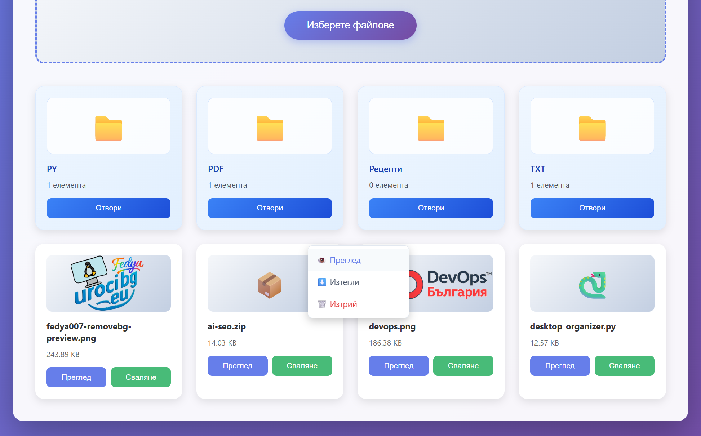
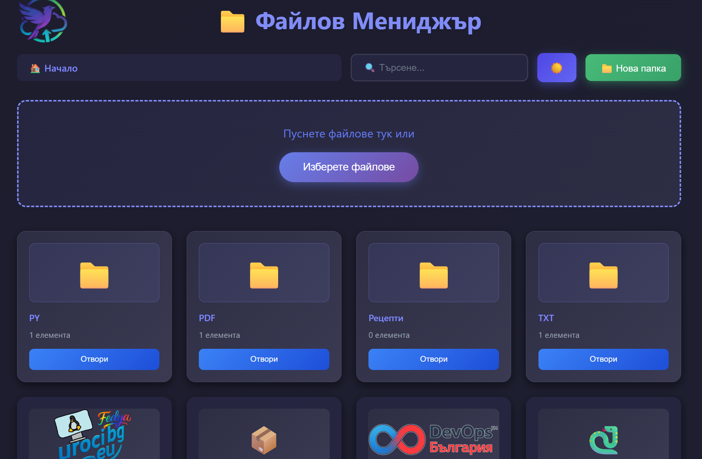

# 📁 Файлов Мениджър

Професионална уеб базирана система за управление на файлове, разработена с **PHP, JavaScript и HTML/CSS**.  
Проектът предоставя интуитивен, модерен и сигурен интерфейс за работа с файлове и папки директно през браузъра.

---

## 📸 Визуален преглед

### Основен изглед


### Работа с файлове и папки


---

## ✨ Възможности

- 📂 **Файлово управление** – качване, изтегляне, преглед и изтриване на файлове  
- 📁 **Папки** – създаване, навигация и управление на директории  
- 🎯 **Пагинация** – интелигентно разделяне (20 файла на страница)  
- 🔍 **Търсене** – бързо търсене сред файлове и папки  
- 📊 **Преглед на файлове** – изображения, PDF, текст, видео и аудио  
- 🖱️ **Контекстно меню** – десен бутон за бързи действия  
- 🎨 **Модерен интерфейс** – drag & drop, плъзгащо се качване, отзивчив дизайн  

---

## 🚀 Инсталация

### Изисквания
- PHP **7.4+**
- Уеб сървър (Apache, Nginx или вграден PHP сървър)
- Модерен уеб браузър

---

### Стъпка по стъпка

#### 1️⃣ Клониране на хранилището
```bash
git clone https://github.com/fantomas4o/papka
cd papka
2️⃣ Настройка на директориите
bash
Копиране на код
mkdir uploads
chmod 755 uploads
3️⃣ PHP конфигурация
Уверете се, че в php.ini:

file_uploads = On

upload_max_filesize и post_max_size са достатъчно големи

4️⃣ Стартиране на сървъра
bash
Копиране на код
php -S localhost:8000
5️⃣ Достъп
Отворете браузър и посетете:
👉 http://localhost:8000

📁 Структура на проекта
text
Копиране на код
papka/
├── index.html          # Основен интерфейс
├── uploads/            # Качени файлове
├── logo/               # Лого
├── upload.php          # Качване на файлове
├── list.php            # Списък с файлове и папки (JSON)
├── download.php        # Изтегляне на файлове
├── delete.php          # Изтриване на файлове
├── delete_folder.php   # Изтриване на папки
├── create_folder.php   # Създаване на папки
├── images/             # Screenshots за README
└── README.md           # Документация
🛠️ PHP файлове
upload.php – валидира и записва качените файлове

list.php – връща JSON със съдържанието на директория

download.php – сигурно изтегляне на файлове

delete.php – изтриване на файлове с проверки

delete_folder.php – рекурсивно изтриване на папки

create_folder.php – създаване на нови директории

⚙️ Конфигурация
Максимален размер на файловете (php.ini)
ini
Копиране на код
upload_max_filesize = 100M
post_max_size = 100M
Права
bash
Копиране на код
chmod 755 uploads
chmod 755 .
🌐 Използване
Качване на файлове
Drag & drop в зоната за качване

Или бутон „Изберете файлове“

Папки
Нова папка – бутон 📁

Навигация – клик или breadcrumb

Изтриване – десен бутон → 🗑️

Файлове
Преглед – изображения, PDF, текст, медия

Изтегляне – бутон „Сваляне“

Изтриване – десен бутон или икона

🔒 Сигурност
Вградени защити
Валидация на файлови типове

Защита от directory traversal

XSS защита

Ограничен достъп до директории

Препоръки за продукция
Разрешавайте само нужните файлови типове

Добавете автентикация

Използвайте HTTPS

Архивирайте редовно

Следете за зловредни файлове

📱 Отзивчив дизайн
🖥️ Desktop – пълна функционалност

📱 Mobile – touch-friendly интерфейс

📟 Tablet – адаптиран layout

🎨 Персонализация
Цветове
css
Копиране на код
:root {
  --primary-color: #667eea;
  --secondary-color: #764ba2;
  --folder-color: #f0f7ff;
}
Лого
Поставете файл в:

bash
Копиране на код
logo/logo.png
🐛 Отстраняване на проблеми
Файловете не се качват

Проверете uploads права

Проверете file_uploads

Вижте console (F12)

Папките не се създават

Проверете права за запис

Уверете се, че create_folder.php съществува

📄 Лиценз
Този проект е лицензиран под MIT License.

👥 Принос
Fork на проекта

git checkout -b feature/MyFeature

Commit

Push

Pull Request

📞 Поддръжка
GitHub Issues

Автор: Федя Серафиев

🙏 Благодарности
Unicode Icons

uiGradients

Google Fonts

🎨 Създадено с ❤️ от Федя Серафиев

⭐ Ако проектът ви е полезен — дайте звезда в GitHub!

yaml
Копиране на код

---

## Следващо (логичното 😉)
Ако искаш, **следващата стъпка** е:
- 🐳 `Dockerfile`
- `.dockerignore`
- image → Docker Hub  
- README badge за Docker

Кажи ми и **продължаваме подред**.